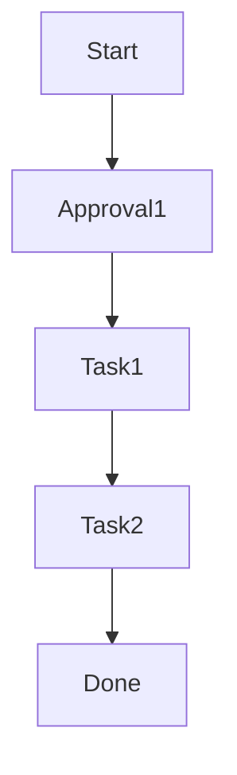

# flowdigraph – BMC/ServiceNow Workflow Visualizer

**flowdigraph** is a Python-based visualizer that takes exported workflows from BMC Remedy or ServiceNow and renders them as interactive Mermaid.js diagrams. It's built for ITSM engineers, architects, and auditors who need to understand complex approval chains and process flows at a glance.

---

## 🔍 Features

- 🧠 Parses BMC Remedy and ServiceNow workflow exports
- 📈 Converts tasks, transitions, and approvals into flow diagrams
- 🧩 Outputs Mermaid.js format for Markdown, Docs, or Live Viewers
- 🌐 Includes browser-based preview tool
- 📁 Minimal setup, extensible Python modules

---

## 🧠 Example Diagram Output



---

## 🚀 Quickstart

### 1. Install requirements

```bash
pip install -r requirements.txt
```

### 2. Run the parser + diagram builder

```bash
python main.py examples/sample_servicenow.json output/sample_output.md
```

### 3. Copy Mermaid block to `templates/viewer.html` OR embed in docs

---

## 📁 Project Structure

```text
flowdigraph/
├── main.py
├── parser/
│   ├── servicenow_parser.py
│   └── bmc_parser.py
├── render/
│   └── mermaid_builder.py
├── examples/
│   └── sample_servicenow.json
├── output/
│   └── sample_output.md
├── templates/
│   └── viewer.html
├── requirements.txt
├── README.md
```

---

## 🧪 Sample JSON (ServiceNow)

```json
{
  "workflow_steps": [
    { "name": "Start", "transitions": [{ "to": "Approval1" }] },
    { "name": "Approval1", "transitions": [{ "to": "Task1" }] },
    { "name": "Task1", "transitions": [{ "to": "Task2" }] },
    { "name": "Task2", "transitions": [{ "to": "Done" }] },
    { "name": "Done", "transitions": [] }
  ]
}
```

---

## 🔭 Planned Enhancements

- ✅ BMC Remedy parser
- ✅ Mermaid class styling per step type (e.g., Approval, Task)
- ⏳ PNG/SVG export via mermaid-cli
- ⏳ Drag-and-drop JSON to viewer
- ⏳ Conditional/parallel flow support
- ⏳ Live Flask UI with upload + render

---

## 📄 License

MIT

---

## 🙌 Contribute

PRs welcome! Looking for contributors to support:
- Remedy XML parsing
- Mermaid layout customization
- Workflow metadata interpretation

